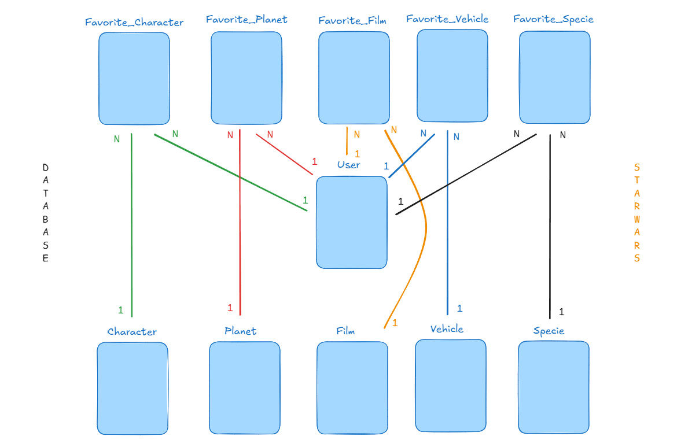

# Star Wars Database (SQLAlchemy)

Este proyecto es una base de datos básica inspirada en el universo de **Star Wars**, desarrollada con **Python** y **SQLAlchemy**.

Incluye modelos principales como:
- **Users**
- **Characters**
- **Planets**
- **Films**
- **Vehicles**
- **Species**

Además, incorpora un sistema de **favoritos** para que cada usuario pueda guardar:
- personajes favoritos
- planetas favoritos
- películas favoritas
- vehículos favoritos
- especies favoritas

El objetivo principal es practicar y demostrar el diseño de relaciones entre tablas (1:N) usando ORM.

## Database Diagram

